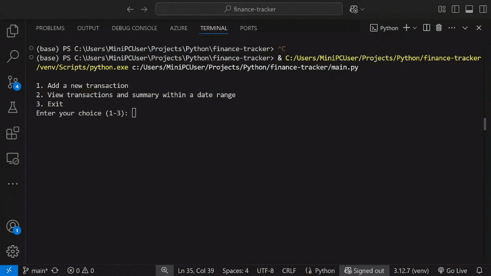
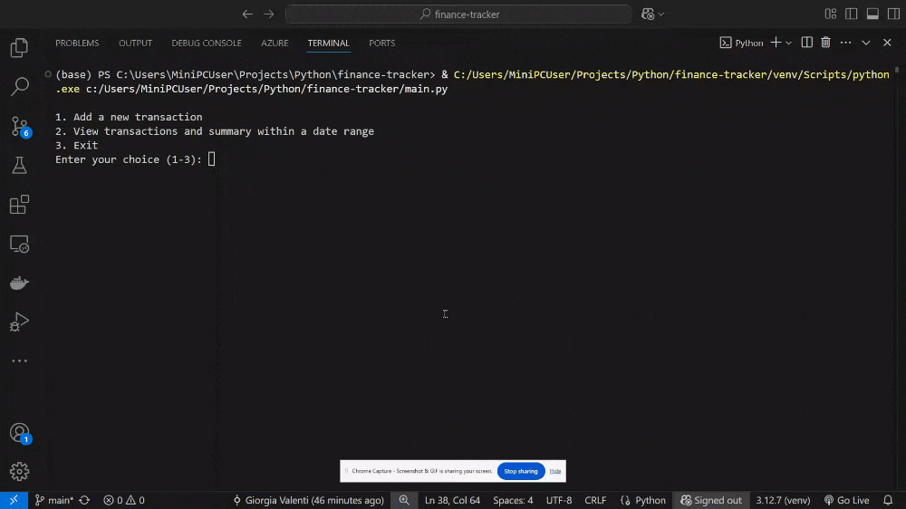

# Python Personal Finance Tracker

A simple Personal Finance Tracker built in Python.  
This application allows users to record income, expenses, and generate summaries of their financial data.  
It’s designed to help manage personal budgets.

## Features

- Add income and expenses with descriptions, categories, and amounts
- View transaction history
- Generate summaries:
  - Total income and expenses
  - Balance
  - Breakdown by category

## Preview

## License

This project is for educational use only.
